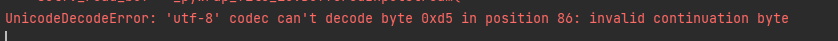
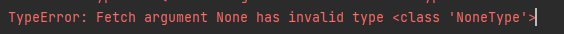

# 迁移学习——使用Inception_v3 or Mobilenet models

展示了如何使用在ImageNet images数据集上训练的Inception v3 or Mobilenet models去迁移学习到另一个数据集上训练。

### bottleneck layer

指的是最后一层（负责分类的softmax层）之前的那一层。

因此，训练集中的所有图像在训练过程中都被使用数次，而瓶颈层在之前那些层的计算在每个图像上会耗费大量时间。所以，将低层的输出缓存到磁盘上，这样可以避免浪费很多时间。

bottleneck layter 默认保存路径是 ~/tmp/bottleneck

### 参数

`--image_dir`

​	图片数据集目录，使用此数据集，并拆分成train、valid、test，拆分与testing_sets_percentage、  	validation_sets_percentage有关

`--output_graph`

​	最终训练图存储路径

​	默认：`./tmp/output_graph.pb`

`--intermediate_output_graph_dir`

​	中间训练图存储路径

​	默认：`./tmp/intermediate_graph/`

`--intermediate_store_frequency`

​	经过多少个epoch存储一次中间图。如果设置为'0'将不存储

​	默认：0

`--output_labels`

​	图像的标签存储路径

​	默认：`./tmp/output_labels.txt`

`--summaries_dir`

​	summary logs 的存储路径

​	默认：`./tmp/summary_logs`

`--epoch`

​	运行多少个epoch

​	默认：1000

`--learning_rate`

​	学习率，使用的是sgd去最小化损失函数

​	默认：0.01

`--testing_sets_percentage`

​	测试集占总数据集的百分比

​	默认：10

`--validation_sets_percentage`

​	验证集占总数据集的百分比

​	默认：10

`eval_step_interval`

​	验证步长，经过多少个epoch验证一次训练结果

​	默认：10

`--train_batch_size`

​	训练批次大小

​	默认：100

`--test_batch_size`

​	测试批次大小， -1表示使用全部测试集

​	默认：-1

​	

`--validation_batch_size`

​	验证批次大小， -1表示使用全部验证集

​	默认：-1

`--print_misclassified_test_images`

​	输出错误分类的测试图片路径，

​	参数输入`--print_misclassified_test_images`即为Ture（后面不能配置具体的值），不输入		即为默认

​	默认：False；action='store_true'

`--model_dir`

​	预训练模型存储位置

​	默认：`./model`

`--bottleneck_dir`

​	bottleneck层输出图片数据缓存位置

​	默认：`./tmp/bottleneck`

`--final_tensor_name`

​	新加的最后一层分类层的名称，使用加权求和取softmax输出作为最终分类结果

​	默认：`final_result`

`--flip_left_right`

​	是否以0.5的概率随机水平翻转图像，进行数据增强

​	默认：False；action='store_true'

`--random_crop`

​	设置随机裁剪为原图像的百分比，裁剪中心位置是全图的一个随机位置

​	默认：0，不裁剪

`--random_scale`

​	设置随机缩放范围为原图像的百分比（设置的）到全图大小之间，缩放中心位置总是在全图居中

​	默认：0，不缩放

`--random_brightness`

​	图片像素值随机乘以一个[1-x,1+x]范围内的整数，我们设置x的百分比

​	默认：0，（相当于乘1）

`--architecture`

​	使用的模型体系结构 

​	`inception_v3` 或 `mobilenet_<parameter size>_<input_size>[_quantized]`

​	默认：`inception_v3`

### 零散记录

- tenorflow版本：2.3.0

- 

  不是编码问题，而是路径错误，找不到文件

- `os.path.exists`不区分大小写

- 、

  `tf.compat.v1.summary.merge_all()`返回值为空

  需使用`tf.compat.v1.summary.scalar` 和  ` tf.compat.v1.summary.histogram` 才能返回正确结果

